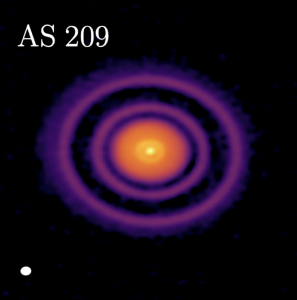

{#fig-as209 fig-align="center" width="650"}

Como se muestra en la @fig-as209, el disco de AS 209 presenta una secuencia de anillos brillantes y brechas oscuras en la emisión continua del polvo.

## Nombres del objeto

| Catálogo | Nombre | Fuente |
|---|---|---|
| Nombre principal | AS 209 | [@fedele2018] |
| Otras designaciones | PDS 92; V1121 Oph; HBC 270; IRAS 16464-1416 | [@gregorio-hetem1992iras] |
| Ubicación | Región de formación estelar de Ofiuco | [@fedele2018] |

## Ubicación

AS 209 se encuentra en la **nube molecular de Ofiuco**, una región cercana de formación estelar que alberga numerosos sistemas jóvenes. En la literatura, la fuente se describe como una **estrella T Tauri** ubicada en la joven región de formación estelar de Ofiuco, a una distancia de **126 pc** del Sol [@fedele2018].

Su cercanía convierte a AS 209 en un objetivo excelente para observaciones milimétricas de alta resolución, ya que permite estudiar con detalle tanto las subestructuras del polvo como las del gas.

## Descripción general del sistema

AS 209 es un sistema protoplanetario joven alrededor de una estrella T Tauri, con tipo espectral **K5**, masa estelar de aproximadamente **0.83–0.9 M☉** y luminosidad de **1.5 L☉** [@tazzari2016; @fedele2018; @zhang2018]. Se encuentra en la región de formación estelar de Ofiuco, a una distancia de **126 pc** [@fedele2018].

En el continuo a **1.3 mm**, Fedele et al. muestran que su disco presenta un núcleo central brillante, dos anillos prominentes alrededor de **~75 au** y **~130 au**, y dos brechas alrededor de **~62 au** y **~103 au**. La brecha interna es más estrecha y menos profunda que la externa [@fedele2018].

Sobre esta base observacional, Zhang et al. destacan la buena concordancia entre observaciones y simulaciones para AS 209, describiéndolo como un sistema con muchas brechas. Esto refuerza la idea de que AS 209 es un objeto especialmente valioso para estudiar subestructuras de disco y su posible conexión con la formación planetaria [@zhang2018].

Además, el análisis multi-longitud de onda de Tazzari et al. muestra evidencia de evolución radial del polvo: los granos más grandes se concentran en las regiones internas, mientras que los granos más pequeños dominan el disco externo [@tazzari2016]. Esto sugiere que el crecimiento y la redistribución de sólidos no ocurren de forma uniforme en todo el disco.

## Propiedades generales del sistema

| Propiedad | Valor | Descripción | Fuente |
|---|---|---|---|
| Distancia | 126 pc | Distancia desde el Sol hasta AS 209. | [@fedele2018] |
| Edad | ~0.5–1.0 Myr | Edad estimada del sistema. | [@fedele2018] |
| Tipo espectral | K5 | Clase espectral de la estrella central. | [@fedele2018] |
| Temperatura estelar | 4250 K | Temperatura efectiva de la estrella. | [@fedele2018] |
| Masa estelar | 0.83–0.9 M☉ | Masa de la estrella central. | [@zhang2018; @fedele2018] |
| Luminosidad estelar | 1.5 L☉ | Luminosidad de la estrella central. | [@fedele2018] |
| Radio del disco de polvo | ~170–180 au | Extensión externa de la emisión continua del polvo. | [@fedele2018] |
| Radio externo del gas | >200 au | Extensión externa del disco trazado por emisión de CO. | [@favre2019] |
| Inclinación del disco | 35.3 ± 0.8° | Inclinación del disco respecto de la línea de visión. | [@fedele2018] |

## Morfología del disco

AS 209 presenta una arquitectura radial con múltiples brechas. Zhang et al. señalan que estudios previos identificaron varios anillos oscuros en este sistema, ubicados aproximadamente a **9, 24, 35, 61, 90, 105 y 137 au** [@zhang2018]. Estas subestructuras no tienen todas la misma profundidad, sino que varían dependiendo de su ubicación dentro del disco.

Por ejemplo, la brecha alrededor de **61 au** es menos profunda que la brecha principal y se ubica a una distancia que permite interpretarla como una brecha secundaria inducida por un planeta [@zhang2018]. En otras palabras, esta brecha sería menos marcada que la brecha principal cercana a **100 au**.

Dentro de ese mismo marco interpretativo, Zhang et al. muestran que una simulación con un planeta ubicado a **99 au** puede reproducir no solo la brecha principal alrededor de **100 au**, sino también la posición y amplitud de brechas internas secundarias, terciarias e incluso una cuarta brecha a **61, 35 y 24 au** [@zhang2018].

Esta morfología también se observa claramente en el continuo de polvo presentado por Fedele et al. En esas observaciones, la emisión continua está caracterizada por un núcleo central brillante y dos anillos de polvo más débiles que alcanzan su máximo cerca de **~75 au** y **~130 au**, separados por dos brechas a **~62 au** y **~103 au** [@fedele2018].

En general, la distribución de brillo a **1.3 mm** de AS 209 puede describirse mediante un perfil con dos brechas profundas y un anillo externo de exceso de emisión alrededor de **~130 au** [@fedele2018]. Por lo tanto, el disco no es una estructura continua y lisa, sino un sistema con anillos y brechas radiales bien definidos.

## Mediciones morfológicas

| Estructura | Medición | Descripción | Fuente |
|---|---|---|---|
| D9 | 9 au | Brecha de polvo interna identificada en el disco de AS 209. | [@zhang2018] |
| D24 | 24 au | Brecha interna de polvo; interpretada como una cuarta brecha interna en el escenario de un solo planeta. | [@zhang2018] |
| D35 | 35 au | Brecha interna de polvo; interpretada como una brecha terciaria en el escenario de un solo planeta. | [@zhang2018] |
| D61 | 61 au | Brecha secundaria de polvo; menos profunda que la brecha principal. | [@zhang2018] |
| D62 | 61.7 ± 0.5 au | Brecha interna principal identificada en el continuo a 1.3 mm. | [@fedele2018] |
| B75 | ~75 au | Anillo interno de polvo donde la emisión continua alcanza un máximo. | [@fedele2018] |
| D90 | 90 au | Brecha de polvo identificada en el disco externo. | [@zhang2018] |
| D105 | 105 au | Brecha de polvo asociada con la región de la brecha externa principal. | [@zhang2018] |
| D103 | 103.2 ± 0.4 au | Brecha externa principal identificada en el continuo a 1.3 mm. | [@fedele2018] |
| B130 | ~130 au | Anillo externo de polvo donde la emisión continua alcanza un máximo. | [@fedele2018] |
| D137 | 137 au | Brecha externa de polvo en la región más alejada del disco. | [@zhang2018] |

## Polvo en el disco

El estudio del polvo en discos protoplanetarios se apoya en observaciones de alta resolución angular a longitudes de onda submilimétricas y milimétricas, ya que estas permiten rastrear la distribución radial de los granos sólidos [@tazzari2016].

En AS 209, el polvo no se distribuye de manera uniforme. El análisis multi-longitud de onda muestra que el tamaño máximo de grano disminuye con el radio: en el disco interno, entre **15 y 30 au**, se infieren granos grandes de hasta aproximadamente **1 cm**, mientras que en el disco externo, a radios mayores que **~80 au**, predominan granos más pequeños, de tamaño cercano a **1 mm** [@tazzari2016].

Esta variación radial indica que el crecimiento y la evolución del polvo dependen de las condiciones locales del disco. Los granos grandes tienden a concentrarse en regiones internas, mientras que el material de menor tamaño domina las zonas externas.

Fedele et al. muestran además que la depleción de polvo no es igual en todas las brechas. La brecha interna se encuentra parcialmente rellena por granos milimétricos, mientras que la brecha externa está mucho más vacía de polvo [@fedele2018]. Esto indica que las subestructuras del disco afectan de manera distinta a los sólidos dependiendo de su ubicación.

Un proceso clave para interpretar esta distribución es la deriva radial. En principio, la deriva radial tendería a remover rápidamente los granos grandes del disco en escalas menores a 1 Myr, a menos que existan mecanismos capaces de detener o ralentizar su migración [@tazzari2016]. En AS 209, los anillos pueden actuar como **trampas de polvo**, donde la migración radial hacia el interior se reduce o se detiene [@fedele2018].

Estas trampas ofrecen un ambiente favorable para que el polvo crezca localmente y se acumule. En este escenario, un planeta podría abrir una brecha y producir una acumulación de polvo en el borde externo de su órbita [@fedele2018].

## Propiedades del polvo

| Propiedad | Valor | Descripción | Fuente |
|---|---|---|---|
| Extensión externa del continuo de polvo | ~170–180 au | Extensión radial externa de la emisión tenue del continuo de polvo. | [@fedele2018] |
| Masa de polvo | 3.5 × 10^-4 M☉ | Masa de polvo fiducial adoptada para reproducir la estructura observada del polvo. | [@fedele2018] |
| Tamaño máximo de grano | 2000 μm | Tamaño máximo de grano adoptado para la población de polvo grande en el modelo de AS 209. | [@fedele2018] |
| Factor de depleción del gap interno | ~0.03 | Factor de reducción de brillo del gap interno en el mejor ajuste. | [@fedele2018] |
| Factor de depleción del gap externo | ~0.025 | Factor de reducción de brillo del gap externo en el mejor ajuste. | [@fedele2018] |
| Densidad superficial de polvo | 0.17 g cm^-2 | Cantidad promedio de polvo por unidad de área en el disco externo, alrededor del gap principal. | [@zhang2018] |

## Gas en el disco

En AS 209, el gas tampoco se distribuye uniformemente, y su estructura se vuelve más clara cuando se analizan distintos trazadores moleculares en conjunto.

La emisión de C$^{18}$O revela una organización radial bien definida, con una concentración interna de gas cerca de la estrella y un anillo externo alrededor de **140 au**, separados por una región de emisión más débil [@favre2019]. Además, su perfil radial presenta una caída de intensidad entre las dos brechas del continuo, lo que sugiere que las subestructuras observadas en el polvo también tienen una contraparte en el gas [@favre2019].

Esta conexión se refuerza con Fedele et al., quienes señalan que la emisión extendida de C$^{18}$O alcanza un máximo cerca de **130 au**, en una región coespacial con el anillo externo de polvo [@fedele2018]. Esto indica que el anillo externo de polvo también tiene una contraparte gaseosa.

Además, esa emisión a gran escala de C$^{18}$O parece seguir la densidad superficial real del gas en el disco externo y apunta a una caída de densidad de gas por un factor de algunos dentro de la brecha externa **D103** [@fedele2018]. Por lo tanto, la brecha externa no es solo una subestructura del polvo, sino también una región donde disminuye la densidad del gas.

En contraste, DCO$^+$ no sigue exactamente el mismo patrón que C$^{18}$O. Favre et al. reportan dos anillos de DCO$^+$: uno ubicado entre las dos brechas principales de polvo y otro más allá de la brecha externa [@favre2019]. Esto muestra que distintos trazadores revelan distintas condiciones físicas y químicas dentro del disco.

Para explicar la morfología observada, Favre et al. concluyen que la densidad superficial del gas debe disminuir dentro de las brechas [@favre2019]. Esto significa que los efectos de temperatura u opacidad por sí solos no son suficientes: se requiere una disminución real en la densidad superficial del gas.

En conjunto, esta evidencia apoya una interpretación dinámica del disco, donde la estructura gaseosa de AS 209 habría sido modificada por una perturbación del gas producida por uno o más planetas en formación [@favre2019].

## Propiedades del gas

| Propiedad | Valor | Descripción | Fuente |
|---|---|---|---|
| Extensión externa de CO | >200 au | El gas trazado por CO se extiende más lejos que el disco de polvo milimétrico. | [@favre2019] |
| Emisión interna de C$^{18}$O | ≤60 au | Concentración interna de gas cerca de la estrella, trazada por C$^{18}$O. | [@favre2019] |
| Anillo externo de C$^{18}$O | 140 au | Anillo gaseoso externo detectado en emisión de C$^{18}$O. | [@favre2019] |
| Anillo interno de DCO$^+$ | 66–95 au | Anillo gaseoso ubicado entre las dos brechas principales de polvo. | [@favre2019] |
| Anillo externo de DCO$^+$ | >120 au | Anillo gaseoso externo detectado más allá de la brecha externa de polvo. | [@favre2019] |
| Profundidad óptica de C$^{18}$O | ≤0.8 | C$^{18}$O es ópticamente delgado, por lo que traza de manera más directa la estructura del gas. | [@favre2019] |
| Profundidad óptica de CO y $^{13}$CO | ≥2.5 | CO y $^{13}$CO son ópticamente gruesos, por lo que pueden ocultar parte de la estructura del gas. | [@favre2019] |

## Evidencia de formación planetaria

En AS 209, la evidencia de formación planetaria no depende de una única subestructura aislada, sino de la forma consistente en que observaciones y modelos describen el disco como un sistema dinámicamente perturbado.

En el continuo milimétrico, ya se había propuesto que los anillos y brechas observados a **1.3 mm** probablemente se deben a la formación de planetas, en concordancia con simulaciones hidrodinámicas [@favre2019]. Esto significa que la arquitectura anillada del disco es compatible con la acción de planetas en formación.

Esta interpretación se fortalece con los resultados de Zhang et al. Una simulación con un planeta ubicado a **99 au** no solo reproduce la brecha principal alrededor de **100 au**, sino también la posición y amplitud de varias brechas internas, incluyendo las de **61, 35 y 24 au** [@zhang2018]. En otras palabras, un solo planeta embebido podría explicar tanto la brecha principal como varias subestructuras internas.

Por esta razón, Zhang et al. concluyen que AS 209 es uno de los casos más plausibles donde realmente podría existir un planeta dentro de la brecha de **~100 au** [@zhang2018].

La evidencia no proviene solo del polvo. Favre et al. concluyen que las brechas de polvo observadas probablemente se deben a una perturbación de la densidad superficial del gas inducida por un planeta en formación de al menos **0.2 M_J** [@favre2019]. Esto refuerza la idea de que las brechas no son simples variaciones aparentes de brillo, sino el resultado de un proceso real de interacción planeta-disco.

## Interpretación física de AS 209

AS 209 puede entenderse como un disco joven donde la evolución del polvo y la interacción planeta-disco actúan de manera conjunta.

Por un lado, el polvo no evoluciona uniformemente en todo el sistema. Los granos más grandes se concentran hacia las regiones internas, mientras que los granos más pequeños dominan en zonas más externas. Este patrón es consistente con crecimiento de granos, deriva radial y la necesidad de mecanismos de retención que eviten que los sólidos se pierdan rápidamente hacia la estrella [@tazzari2016].

Por otro lado, la arquitectura de anillos y brechas se explica mejor si el disco está siendo esculpido dinámicamente por un planeta embebido en un ambiente de muy baja viscosidad. Zhang et al. muestran que un planeta con \(q = 10^{-4}\), en un disco con \(\alpha = 10^{-5}\) y \(h/r = 0.05\), puede explicar cinco brechas ubicadas a **24, 35, 62, 90 y 105 au** [@zhang2018]. Esto implica que un único planeta externo podría explicar gran parte de la estructura radial del sistema.

Esta interpretación es aún más fuerte porque el gas también se encuentra genuinamente perturbado. Favre et al. concluyen que las brechas de polvo observadas probablemente se deben a una perturbación en la densidad superficial del gas inducida por un planeta de al menos **0.2 M_J** en formación [@favre2019]. Esto indica que las brechas no son solo variaciones de brillo en el polvo, sino señales de una reorganización real de la densidad superficial del disco.

En conjunto, AS 209 se interpreta mejor como un disco de baja turbulencia en el que un planeta en formación ya estaría remodelando tanto el polvo como el gas, dejando una huella observable de formación planetaria en curso.

## Referencias

::: {#refs}
:::