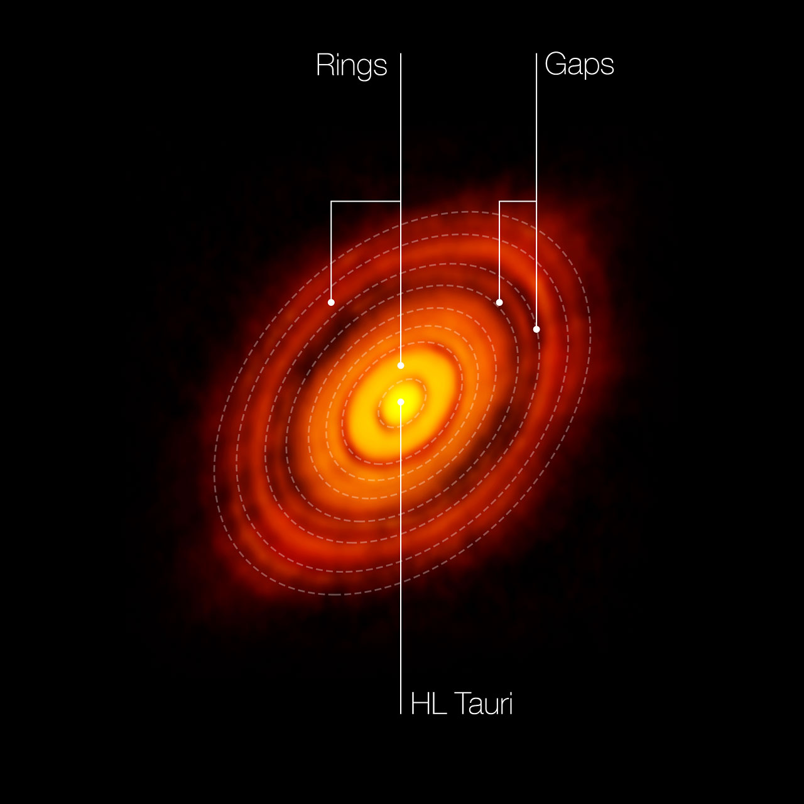

::: {.catalog-intro}
An interactive catalog of **protoplanetary disks** designed to explore disk morphology, annular substructures, and possible signatures of planet formation from observational data.

This site combines **scientific summaries**, **individual disk pages**, and future **data-science activities** for selected systems.
:::

## Available disks

::: {.disk-card}
{width=100%}

### HL Tau

A young protoplanetary disk well known for its concentric rings and gaps revealed by ALMA.

[Open disk page →](hl_tau.qmd){.disk-link}
:::