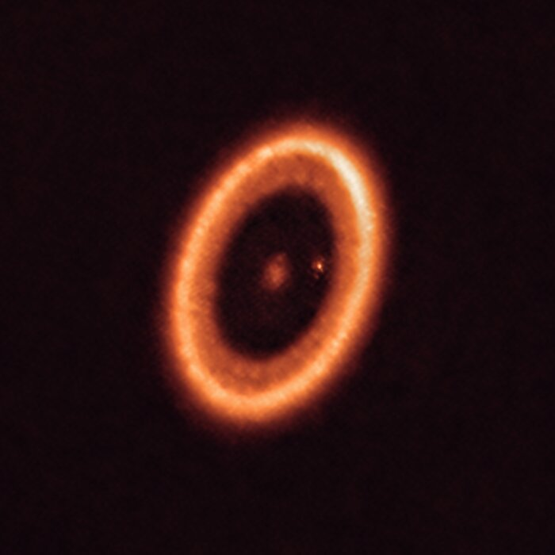

::: {.catalog-intro}

This **Pilot Protoplanetary Disk Catalog** is an educational and scientific resource designed to explore the physical properties, morphologies, and evolutionary processes of **protoplanetary disks**.

The goal of this catalog is to organize observational and theoretical knowledge about young circumstellar disks using results from the scientific literature. Each disk entry summarizes its stellar properties, disk morphology, and observational signatures that may be related to planet formation.

The catalog focuses particularly on **disk substructures**, such as rings, gaps, spirals, and asymmetries, which have become central observational features in modern studies of planet-forming disks.

:::

---

# What is a protoplanetary disk?

A **protoplanetary disk** is a rotating structure of gas and dust that surrounds a young star during the early stages of stellar evolution. These disks form naturally during star formation, when the gravitational collapse of a molecular cloud core produces a protostar while conserving angular momentum. As a consequence, part of the infalling material settles into a flattened rotating disk.

As described by Armitage (2011):

> “They can be defined as rotationally supported structures of gas (invariably containing dust) that surround young, normally pre-main-sequence stars.” (Armitage, 2011, p. 196)

These disks contain the raw material from which planetary systems form. Gas dominates the mass budget of the disk, while solid particles — dust grains and larger aggregates — represent a smaller fraction but play a fundamental role in planet formation.

Protoplanetary disks are also relatively short-lived structures in astronomical terms. Observations indicate that:

> “Around low-mass stars, protoplanetary disks are persistent; the typical lifetime of ∼10⁶ years (Haisch, Lada & Lada 2001) equates to thousands of dynamical times at 100 AU.” (Armitage, 2011, p. 196)

This limited lifetime sets the time window during which planets must form before the gas disperses.

From a physical perspective, the most important property of a disk is how its mass is distributed. As emphasized in observational studies of disks:

> “The spatial distribution of mass—the density structure—is without question the fundamental property of interest for disks.” (Andrews, 2020)

Understanding this density structure is essential because it determines the disk’s temperature, dynamics, and the processes that control planet formation.

---

# Available disks

::: {.disk-card}
{width=100%}

### HL Tau

A young protoplanetary disk well known for its concentric rings and gaps revealed by ALMA.

[Open disk page →](hl_tau.qmd){.disk-link}
:::

---

# Images of protoplanetary disks

Below are examples of protoplanetary disks observed at high angular resolution. These observations reveal a wide diversity of disk morphologies and structures.

::: {.disk-gallery}

::: {#fig-hltau}
{width=70% fig-alt="HL Tau protoplanetary disk observed with ALMA"}

Composite image of the young star **HL Tau** and its surrounding protoplanetary disk obtained with ALMA and the Hubble Space Telescope, illustrating the ringed disk structure and the scale of the system relative to the Solar System.  
**Credit:** ALMA (ESO/NAOJ/NRAO), NASA/ESA.
:::

::: {#fig-as209}
{width=70% fig-alt="AS 209 protoplanetary disk observed with ALMA"}

ALMA image of the protoplanetary disk **AS 209**, showing thin, high-contrast rings viewed nearly face-on. These substructures were observed as part of the DSHARP survey and provide key clues about how planets may form and grow within young disks.  
**Credit:** ALMA (ESO/NAOJ/NRAO), S. Andrews et al.; NRAO/AUI/NSF, S. Dagnello.
:::

::: {#fig-hd163296}
{width=70% fig-alt="HD 163296 protoplanetary disk observed with ALMA"}

ALMA image of the protoplanetary disk surrounding the young star **HD 163296**. Observations of the disk revealed structures in both the dust and gas distributions that suggest the presence of two forming planets embedded in the disk.  
**Credit:** ALMA (ESO/NAOJ/NRAO), AUI/NSF, A. Isella, B. Saxton.
:::

::: {#fig-imlupi}
{width=70% fig-alt="IM Lupi protoplanetary disk observed with SPHERE"}

High-resolution image of the dusty protoplanetary disk around the young star **IM Lupi**, obtained with the SPHERE instrument on ESO’s Very Large Telescope, revealing fine structures in the disk.  
**Credit:** ESO/H. Avenhaus et al./DARTT-S collaboration.
:::

::: {#fig-pds70}
{width=70% fig-alt="PDS 70 protoplanetary system observed with ALMA"}

ALMA image of the **PDS 70** system, a young planetary system still in formation. The planets have carved a large cavity in the circumstellar disk, and one of them is associated with a circumplanetary disk where moons may form.  
**Credit:** ALMA (ESO/NAOJ/NRAO)/Benisty et al.
:::

*(Additional images of other disks in the pilot catalog will be included here.)*

:::

These observations, particularly those obtained with **ALMA**, have revealed that disks frequently contain complex structures rather than smooth distributions of gas and dust.

---

# Physical processes shaping protoplanetary disks

The structure and evolution of protoplanetary disks are governed by several fundamental physical processes.

## Disk accretion and angular momentum transport

Gas in a disk orbits the central star approximately in **Keplerian rotation**. However, for material to accrete onto the star, it must lose angular momentum. This redistribution of angular momentum drives disk evolution.

Disk dynamics therefore play a central role in shaping disk structure. As Andrews (2020) notes:

> “Disks are profoundly affected by their fluid dynamics.” (Andrews, 2020)

Theoretical models describe this evolution using the framework of **thin accretion disks**, where the vertical thickness of the disk is small compared with its radius. In fact:

> “Protoplanetary disks are observed to be geometrically thin, in the sense that the vertical scale height \(h \ll r\), and they typically have inferred masses \(M_{disk} \ll M_*\). These properties imply that models of disk evolution should be grounded within the theory of thin accretion disks.” (Armitage, 2011)

Angular momentum transport may occur through several mechanisms, including turbulence, magnetic processes, and disk winds.

## Gravitational instability

In sufficiently massive and cold disks, **self-gravity** can become important. In this regime, gravitational instabilities can generate spiral density patterns that redistribute mass and angular momentum within the disk.

These spiral structures may also concentrate solid particles and potentially contribute to the formation of planetesimals.

---

# Physical processes diagram

::: {.process-diagram}

*(Insert a conceptual diagram illustrating disk physics here)*

Suggested diagram elements:

- gas accretion toward the star  
- outward angular momentum transport  
- spiral structures from gravitational instability  
- pressure traps concentrating dust  
- planet–disk interactions

:::

Such diagrams help illustrate how multiple physical processes interact to shape disk evolution.

---

# Substructures in protoplanetary disks

High-resolution observations have revealed that protoplanetary disks frequently contain **substructures**, meaning localized variations in the distribution of gas or dust.

These structures include rings, gaps, spirals, and asymmetric features. Their discovery has significantly reshaped our understanding of disk evolution and planet formation.

Substructures are particularly important because they can create **local pressure maxima** that trap drifting particles. In smooth disks, solid particles tend to migrate inward rapidly due to aerodynamic drag from the gas. However, pressure maxima can halt this inward drift and concentrate particles, potentially enabling the formation of planetesimals.

---

# Common substructure morphologies

Observations have identified several common classes of disk substructures.

## Rings and cavities

These systems display a central cavity surrounded by a bright ring of dust emission. This morphology is typical of **transition disks**.

## Rings and gaps

This is the most common substructure pattern observed in millimeter continuum images. It consists of concentric bright rings separated by darker gaps.

## Arcs

Some disks show asymmetric arc-shaped structures, which may correspond to vortices or local dust concentrations.

## Spirals

Large-scale spiral patterns can arise from gravitational instability or perturbations produced by massive companions or forming planets.

---

# Images of disk substructures

::: {.substructure-gallery}

::: {#fig-elias24}
{width=70% fig-alt="Elias 24 protoplanetary disk rings and gaps observed with ALMA"}

ALMA image of the protoplanetary disk **Elias 24**, showing prominent concentric rings and gaps in the dust distribution, typical substructures observed in planet-forming disks.  
**Credit:** ALMA (ESO/NAOJ/NRAO), S. Andrews et al.; N. Lira.
:::

::: {#fig-mwc758}
{width=70% fig-alt="MWC 758 protoplanetary disk spiral and arc structures"}

Composite image of the planet-forming disk **MWC 758**, combining infrared observations from the SPHERE instrument on ESO’s Very Large Telescope with millimeter observations from ALMA. The image reveals asymmetric structures and arcs in the dust distribution that may be related to planet–disk interactions.  
**Credit:** ESO/A. Garufi et al.; R. Dong et al.; ALMA (ESO/NAOJ/NRAO).
:::

These images illustrate how disk structures can vary significantly between systems and may provide clues about the processes occurring within them.

---

# References

Armitage, P. J. (2011). *Dynamics of Protoplanetary Disks*. Annual Review of Astronomy and Astrophysics.

Andrews, S. M. (2020). *Observations of Protoplanetary Disk Structures*. Annual Review of Astronomy and Astrophysics.