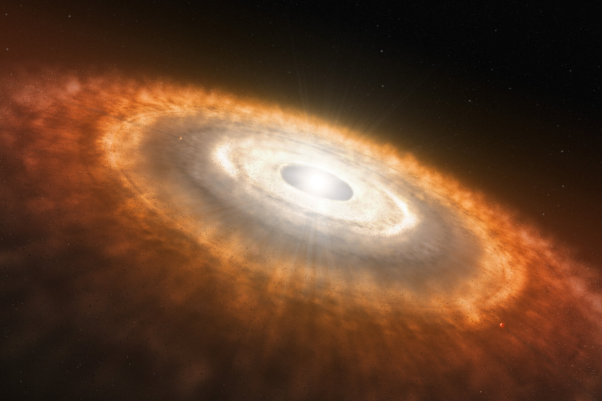
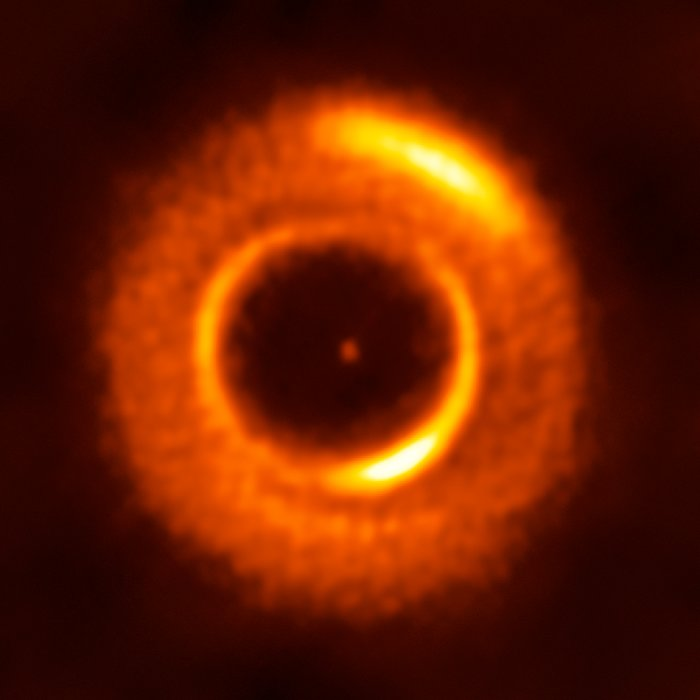

::: {.catalog-hero}

::: {.catalog-hero-text}

::: {.hero-kicker}
Educational + scientific web catalog
:::

This **Pilot Protoplanetary Disk Catalog** is an educational and scientific resource designed to explore the physical properties, morphologies, and evolutionary processes of **protoplanetary disks**.

This pilot version combines short scientific summaries, representative images, comparative tables, and introductory programming activities based on real astronomical data products.

::: {.hero-badges}
5 pilot disks
Scientific summaries
Programming activities
FITS-based learning
:::

::: {.hero-actions}
[Explore disks ↓](#available-disks){.hero-button .hero-button-primary}
[Open activities →](activities.qmd){.hero-button .hero-button-secondary}
[How to use this catalog ↓](#how-to-use-catalog){.hero-button .hero-button-secondary}
:::

:::

::: {.catalog-hero-image}
{.catalog-hero-photo}

::: {.hero-image-caption}
*Artist’s impression of a young star surrounded by a protoplanetary disk where planets are forming. The image highlights concentric rings and gaps associated with planet formation.*

**Credit:** ESO/L. Calçada
:::

:::

---

## Activities

This catalog includes **introductory programming activities** designed to help students explore real astronomical data and analyze how disk substructures can be measured from images.

Este catálogo también incluye **actividades introductorias de programación** pensadas para que los estudiantes trabajen con datos astronómicos reales y analicen cómo se pueden medir subestructuras de discos a partir de imágenes.

::: {.activity-grid}

::: {.activity-card}
### Activity 1 / Actividad 1

**Radial profile from a FITS image**  
**Perfil radial a partir de una imagen FITS**

Learn how to read a FITS image, measure brightness as a function of radius, and identify rings and gaps in a protoplanetary disk.

Aprende a leer una imagen FITS, medir el brillo en función del radio e identificar anillos y brechas en un disco protoplanetario.

[Open activity →](activities.qmd#activity-1-actividad-1){.disk-link}
:::

::: {.activity-card}
### Activity 2 / Actividad 2

**Deprojection and polar analysis of a disk image**  
**Deproyección y análisis polar de una imagen de disco**

Apply disk geometry to deproject an inclined image and transform it into polar coordinates to reveal substructures more clearly.

Aplica la geometría del disco para deproyectar una imagen inclinada y transformarla a coordenadas polares para revelar subestructuras con mayor claridad.

[Open activity →](activities.qmd#activity-2-actividad-2){.disk-link}
:::

:::

---

## Available disks {#available-disks}

::: {.disk-grid}

::: {.disk-card}
{width=100%}

*Annotated ALMA image of the protoplanetary disk surrounding the young star HL Tau. The ring–gap structure visible in the dust emission traces variations in the distribution of solid material.  
Credit: ALMA (ESO/NAOJ/NRAO).*

### HL Tau

A young protoplanetary disk well known for its concentric rings and gaps revealed by ALMA.

[Open disk page →](hl_tau.qmd){.disk-link}
:::

::: {.disk-card}
{width=100%}

*ALMA image of the protoplanetary disk around AS 209 showing multiple narrow rings and gaps that may indicate ongoing planet formation.  
Credit: ALMA (ESO/NAOJ/NRAO); A. Sierra (U. Chile).*

### AS 209

A protoplanetary disk observed with ALMA that shows multiple narrow rings and gaps, often interpreted as signatures of planet formation.

[Open disk page →](as_209.qmd){.disk-link}
:::

::: {.disk-card}
{width=100%}

*Composite ALMA image of the protoplanetary disk around HD 163296. The red component traces dust, while the blue emission shows carbon monoxide gas; deficits in the outer disk suggest the presence of forming planets.  
Credit: ALMA (ESO/NAOJ/NRAO); A. Isella; B. Saxton (NRAO/AUI/NSF).*

### HD 163296

A structured protoplanetary disk where dust and gas observations suggest the presence of forming planets embedded in the outer disk.

[Open disk page →](hd_163296.qmd){.disk-link}
:::

::: {.disk-card}
{width=100%}

*High-resolution SPHERE image of the dusty disk around the young star IM Lupi, revealing fine structures in scattered light.  
Credit: ESO/H. Avenhaus et al./DARTT-S collaboration.*

### IM Lup

A large and extended protoplanetary disk observed in scattered light, showing detailed dust structures in its outer regions.

[Open disk page →](im_lup.qmd){.disk-link}
:::

::: {.disk-card}
{width=100%}

*ALMA image of the young planetary system PDS 70, showing a circumstellar disk where planets are forming. The system hosts the confirmed planets PDS 70b and PDS 70c within the disk cavity.  
Credit: ALMA (ESO/NAOJ/NRAO) / Balsalobre-Ruza et al.*

### PDS 70

A young planetary system famous for hosting directly detected forming planets embedded within its protoplanetary disk.

[Open disk page →](pds_70.qmd){.disk-link}
:::

:::

---

## What is a protoplanetary disk?

A protoplanetary disk is a young, flattened structure that forms around a star during its earliest stages, when part of the collapsing material no longer falls directly onto the protostar but instead settles into orbit through “angular momentum conservation” [@williams2011; @andrews2020]. In this sense, it can be understood as a “flattened disk of gas and solids” that accompanies the young star and gathers the material from which the system will continue to evolve. These disks are also the “material reservoirs and birthplaces of planetary systems,” because they host the processes that may eventually lead to the formation of planets [@andrews2020].

Their connection to young stars is therefore direct: they appear “shortly after their birth” and are studied especially around visible young stars such as **T Tauri stars**, during early phases like **Class II YSOs** [@williams2011]. In general, they “form almost immediately after a molecular core collapses,” and they show “an inherent and large diversity in initial disk sizes and masses” [@williams2011]. Once the initial envelope has dispersed, the system is already “truly protoplanetary, not protostellar”; at that stage, the disk contains only “a few percent of the central stellar mass,” usually has a “flared” geometry, and shows approximately “Keplerian” motions, features that describe its basic shape and dynamics [@williams2011].

These disks not only store material, but also provide the setting where planet formation begins. In the “core accretion model,” dust grains grow through several stages until they become rocks, planetesimals, and protoplanetary cores capable of capturing gas [@williams2011]. For that reason, studying the mass, structure, and evolution of a disk helps us understand not only how a young system changes over time, but also what kinds of planets may form within it and how their properties depend on the disk’s physical conditions [@andrews2020].

### How do we observe protoplanetary disks?

Protoplanetary disks are studied at different wavelengths because each tracer reveals a different part of their structure [@andrews2020]. In the optical and near-infrared, “scattered light” primarily traces small dust grains in the disk surface; in the mid-infrared, warmer dust in the inner regions is more easily detected; and at sub-mm/mm wavelengths, “thermal continuum emission” is used to study the distribution of colder solids, while “spectral line emission” probes the properties and dynamics of the gas [@andrews2020]. Because many disks are cold, small on the sky, and emit efficiently at millimeter wavelengths, “radio interferometry” has become essential, and much of the recent progress in the field has been driven by **ALMA**, one of the most important tools for studying protoplanetary disks and their substructures [@andrews2020].

::: {.tracer-gallery}

::: {.tracer-card}
### Scattered light

*Image coming soon.*

*This panel will show an example of a protoplanetary disk observed in scattered light, tracing small dust grains in the disk surface.*
:::

::: {.tracer-card}
### Thermal continuum

{width=100%}

*Thermal continuum image of the protoplanetary disk around MWC 758, observed with ALMA (Band 7, 870 μm). At these wavelengths, the emission traces dust in the disk and reveals its ringed structure.*

**Credit:** ESO/R. Dong et al.; ALMA (ESO/NAOJ/NRAO).
:::

::: {.tracer-card}
### Spectral line emission

*Image coming soon.*

*This panel will show an example of molecular spectral line emission, tracing the gas and its motion in a protoplanetary disk.*
:::

:::

---

## Why does disk morphology matter?

The morphology of a protoplanetary disk matters because it reveals not only what the system looks like, but also how it evolves physically. As Williams & Cieza explain, the circumstellar medium “is composed of dust and gas,” and both components undergo “substantial processing” throughout the lifetime of the disk [@williams2011]. In that context, the gas governs much of the large-scale structure, while the dust responds to that dynamic environment: Birnstiel notes that small particles are “most strongly affected by their coupling to the gas via drag forces,” which promotes settling, radial drift, and concentration at pressure maxima [@birnstiel2024]. Rings, gaps, cavities, spirals, and asymmetries should therefore not be understood as isolated shapes, but as signatures of real redistributions of material within the disk. Along the same lines, Andrews emphasizes that “relationships among disk structure properties are also linked to the masses, environments, and evolutionary states of their stellar hosts” and that these substructures “likely trace active sites of planetesimal growth or are the hallmarks of planetary systems at their formation epoch” [@andrews2020]. From this perspective, the catalog focuses on substructures because reading disk morphology is also a way of interpreting disk evolution and its possible connection to planet formation.

---

## Dust and gas do not trace the same disk

A protoplanetary disk does not look the same in every tracer because each observation highlights a different physical component of the system. As Andrews explains, “the first two are sensitive to the physical conditions and distribution of the solids, and the third is used to measure the properties of the gas” [@andrews2020]. In the dust component, this difference depends not only on the instrument but also on how particles evolve within the disk: Birnstiel notes that “starlight scattered by small dust in the disk surface as well as the thermal continuum emission of the dust particles themselves are the most readily available observational tracers,” but they do not probe the same grain population [@birnstiel2024]. Small grains remain better mixed in the disk surface, whereas larger grains tend to settle toward the midplane, drift radially, and concentrate at pressure maxima. Aikawa, Okuzumi, and Pontoppidan add that ALMA has revealed “grain growth, gas-dust decoupling, and sub-structures such as rings and gaps in the dust continuum,” while “molecular line observations” provide constraints on the radial and vertical structure of molecular abundances as well as on gas dynamics such as turbulence [@aikawa2024]. For that reason, the same disk can look significantly different in scattered light, thermal continuum emission, and molecular lines, and that is precisely why this catalog separates the sections **Dust in the disk** and **Gas in the disk**.

---

## From dust to planets

The path from dust to planets begins with extremely small particles: in protoplanetary disks, the solid material starts at sizes of “≲ 1 µm” [@birnstiel2024]. From there, grains collide, and when those collisions are gentle enough, they can stick together and form progressively larger aggregates. That growth also changes how the particles move: as Williams & Cieza explain, “grain growth and dust settling are intimately interconnected processes,” because as grains grow, they become progressively less coupled to the gas and begin to settle toward the disk midplane, although turbulence can still stir some of that material upward [@williams2011]. As dust grows, its aerodynamic interaction with the gas becomes increasingly important. Birnstiel notes that particles experience a “drag force” when they move relative to the gas, and that matters because the gas orbits in a “slightly sub-Keplerian” way, a little slower than a solid particle responding only to stellar gravity [@birnstiel2024]. As a result, solids feel a small headwind that removes angular momentum and causes them to drift gradually inward toward the star: this process is known as **radial drift**. Growth also does not continue indefinitely, because collisions can stop being “growth-positive” and become “growth-neutral or even destructive”; in other words, aggregates may bounce, fragment, or erode instead of continuing to grow [@birnstiel2024]. This is why the **meter-size barrier** is not a single obstacle, but the combined effect of bouncing, fragmentation, and radial drift, making planetesimal formation far from automatic. For that reason, regions where dust no longer drifts inward so efficiently are especially important. When particles encounter a local pressure maximum, Birnstiel explains that “dust can be trapped,” allowing solids to accumulate into dense concentrations that, in many disks, are observed as dust rings or other substructures [@birnstiel2024]. Such concentrations favor further growth because they retain material and can create conditions in which “planetesimal formation becomes possible” [@birnstiel2024]. In that sense, **dust traps** are especially important because they link the physical evolution of dust with the appearance of substructures and with the formation of planetesimals, which can later become the building blocks of future planetary cores.

---

## How do protoplanetary disks evolve and develop substructures?

The evolution of a protoplanetary disk can be understood as a process of **redistributing material and angular momentum**. Because these disks form through “angular momentum conservation,” gas cannot fall directly onto the star; in order to accrete, it must transfer part of its orbital motion to other regions of the disk [@williams2011]. For that reason, while some material gradually moves inward, another part can spread outward; in this sense, the disk can “accrete onto the star while simultaneously spreading diffusively to large radii” [@armitage2011]. This evolution is often described in terms of an **effective viscosity**, understood not as ordinary molecular friction but as a simplified way to represent angular momentum transport; in many models, that efficiency is summarized with the **α parameter** [@armitage2011]. Among the relevant mechanisms are the **MRI**, which can “initiate and sustain MHD turbulence,” and **self-gravity**, which in sufficiently cold and massive disks can generate “trailing spiral arms” and redistribute both mass and angular momentum [@armitage2011]. But disk evolution is not expressed only on global scales: many observed substructures likely trace **local gas pressure maxima**, where the migration of solids slows down and material can accumulate [@andrews2020]. Those pressure maxima may arise from **fluid instabilities** or from **planet–disk interactions**, and their effects can perturb both gas and dust, manifesting as rings, gaps, spirals, asymmetries, or even **arc**- and **crescent**-like features [@andrews2020]. In that sense, disk morphology is not just appearance: it is an observable way of following the physical processes that govern disk evolution and help set the conditions for planet formation.

---

## How to use and expand this catalog {#how-to-use-catalog}

::: {.catalog-use-box}

This catalog was designed as both an **educational** and a **scientific** resource for exploring protoplanetary disks in a structured, comparative, and accessible way. Its purpose is not only to gather information about different systems, but also to help readers understand how these disks are studied, what their substructures mean, and why they matter for planet formation. For that reason, each disk page combines a clear presentation of the object with a physical reading of its morphology, dust and gas properties, possible evidence of planet formation, and broader scientific interpretation.

Each disk entry is organized to guide the reader from basic identification to scientific interpretation. In general, the pages include sections such as **object names**, **location**, **general description**, **morphology**, **dust**, **gas**, **evidence of planet formation**, and **physical interpretation**, so that each system can be read both as an individual astronomical object and as part of a broader comparative context. The activities are designed to be used alongside the disk entries: they allow the reader not only to view images and summaries, but also to practice how substructures can be measured, analyzed, and interpreted from real astronomical data. In that sense, the catalog is conceived as an **open, editable, and scalable** project that can continue to grow through the addition of **new disks**, **new activities**, **new comparative tables**, and **new simulations**, so that it can keep developing as both a learning tool and a scientific outreach resource.

:::

---

## Images of disk substructures

::: {.substructure-gallery}

::: {#fig-elias24}
{width=70% fig-alt="Elias 24 protoplanetary disk rings and gaps observed with ALMA"}

ALMA image of the protoplanetary disk **Elias 24**, showing prominent concentric rings and gaps in the dust distribution, typical substructures observed in planet-forming disks.  
**Credit:** ALMA (ESO/NAOJ/NRAO), S. Andrews et al.; N. Lira.
:::

::: {#fig-mwc758}
{width=70% fig-alt="MWC 758 protoplanetary disk spiral and arc structures"}

Composite image of the planet-forming disk **MWC 758**, combining infrared observations from the SPHERE instrument on ESO’s Very Large Telescope with millimeter observations from ALMA. The image reveals asymmetric structures and arcs in the dust distribution that may be related to planet–disk interactions.  
**Credit:** ESO/A. Garufi et al.; R. Dong et al.; ALMA (ESO/NAOJ/NRAO).
:::

::: {#fig-irs48}
{width=70% fig-alt="IRS 48 protoplanetary disk dust trap observed with ALMA"}

Composite image of the planet-forming disk **IRS 48 (Oph-IRS 48)** showing a pronounced crescent-shaped dust trap where millimetre-sized grains accumulate. Such structures may help dust grow into larger bodies during planet formation.  
**Credit:** ESO/L. Calçada; ALMA (ESO/NAOJ/NRAO); A. Pohl; van der Marel et al.; Brunken et al.
:::

:::

These images illustrate how disk structures can vary significantly between systems and may provide clues about the processes occurring within them.

---

## References

::: {#refs}
:::