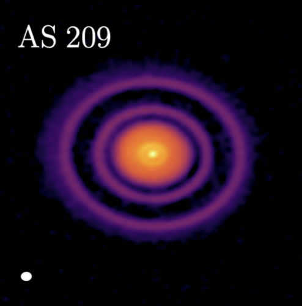
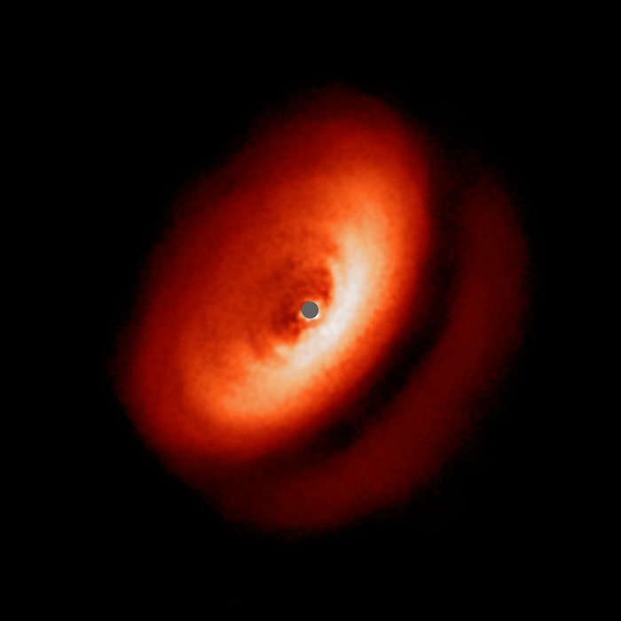
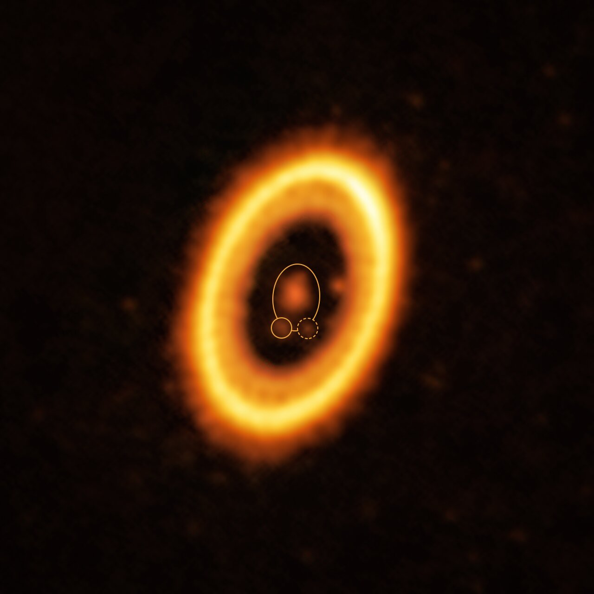
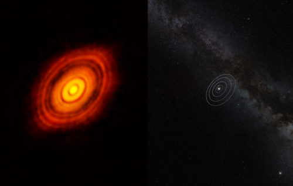
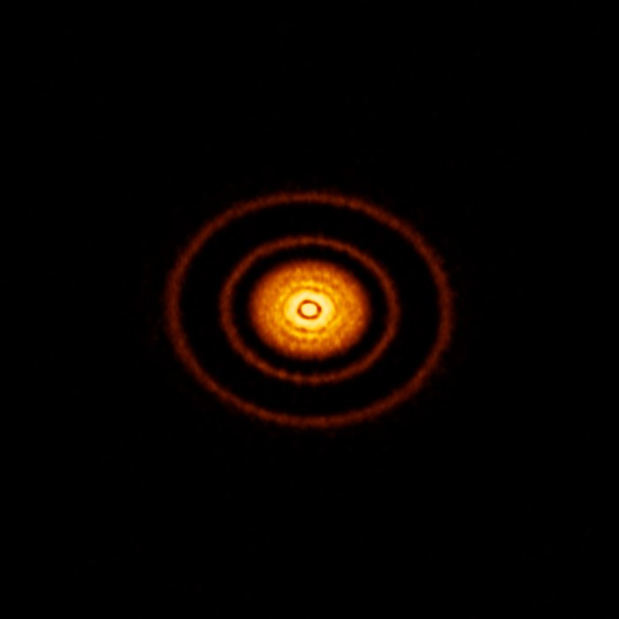
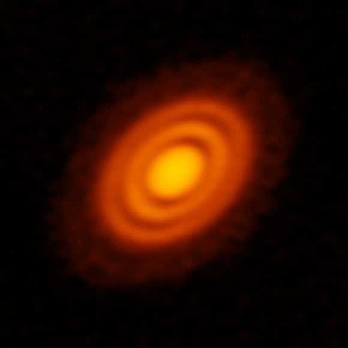
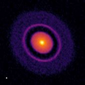
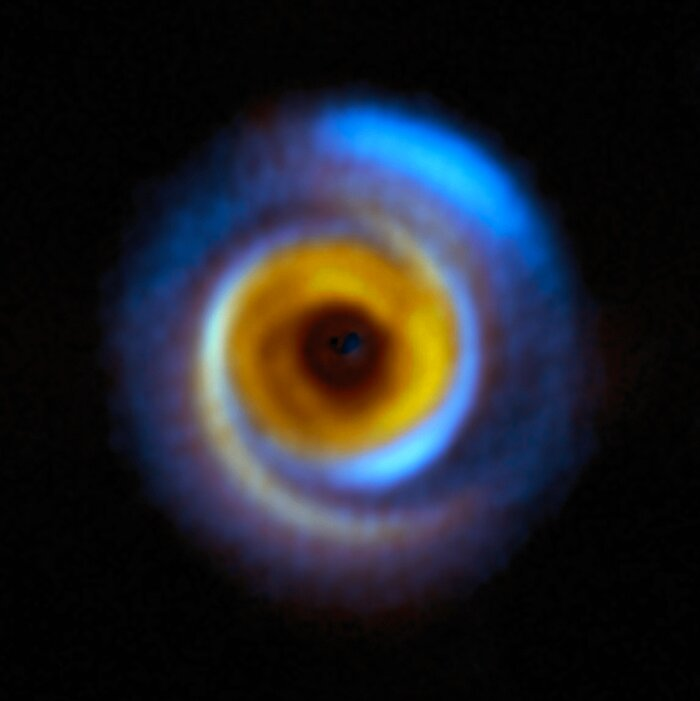
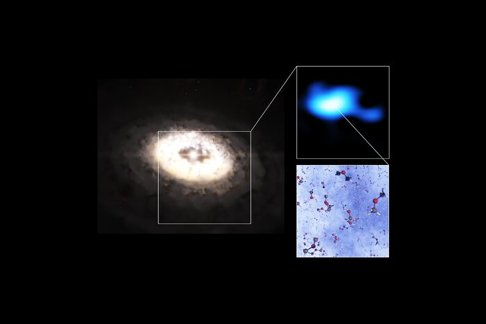

::: {.catalog-intro}

This **Pilot Protoplanetary Disk Catalog** is an educational and scientific resource designed to explore the physical properties, morphologies, and evolutionary processes of **protoplanetary disks**.

This pilot version combines short scientific summaries, representative images, comparative tables, and introductory programming activities based on real astronomical data products.

:::

---

## Activities

This catalog includes **introductory programming activities** designed to help students explore real astronomical data and analyze how disk substructures can be measured from images.

Este catálogo también incluye **actividades introductorias de programación** pensadas para que los estudiantes trabajen con datos astronómicos reales y analicen cómo se pueden medir subestructuras de discos a partir de imágenes.

::: {.activity-grid}

::: {.activity-card}
### Activity 1 / Actividad 1

**Radial profile from a FITS image**  
**Perfil radial a partir de una imagen FITS**

Learn how to read a FITS image, measure brightness as a function of radius, and identify rings and gaps in a protoplanetary disk.

Aprende a leer una imagen FITS, medir el brillo en función del radio e identificar anillos y brechas en un disco protoplanetario.

[Open activity →](activities.qmd#activity-1-actividad-1){.disk-link}
:::

::: {.activity-card}
### Activity 2 / Actividad 2

**Deprojection and polar analysis of a disk image**  
**Deproyección y análisis polar de una imagen de disco**

Apply disk geometry to deproject an inclined image and transform it into polar coordinates to reveal substructures more clearly.

Aplica la geometría del disco para deproyectar una imagen inclinada y transformarla a coordenadas polares para revelar subestructuras con mayor claridad.

[Open activity →](activities.qmd#activity-2-actividad-2){.disk-link}
:::

:::

---

## Available disks

::: {.disk-grid}

::: {.disk-card}
{width=100%}

*Annotated ALMA image of the protoplanetary disk surrounding the young star HL Tau. The ring–gap structure visible in the dust emission traces variations in the distribution of solid material.  
Credit: ALMA (ESO/NAOJ/NRAO).*

### HL Tau

A young protoplanetary disk well known for its concentric rings and gaps revealed by ALMA.

[Open disk page →](hl_tau.qmd){.disk-link}
:::

::: {.disk-card}
{width=100%}

*ALMA image of the protoplanetary disk around AS 209 showing multiple narrow rings and gaps that may indicate ongoing planet formation.  
Credit: ALMA (ESO/NAOJ/NRAO); A. Sierra (U. Chile).*

### AS 209

A protoplanetary disk observed with ALMA that shows multiple narrow rings and gaps, often interpreted as signatures of planet formation.

[Open disk page →](as_209.qmd){.disk-link}
:::

::: {.disk-card}
{width=100%}

*Composite ALMA image of the protoplanetary disk around HD 163296. The red component traces dust, while the blue emission shows carbon monoxide gas; deficits in the outer disk suggest the presence of forming planets.  
Credit: ALMA (ESO/NAOJ/NRAO); A. Isella; B. Saxton (NRAO/AUI/NSF).*

### HD 163296

A structured protoplanetary disk where dust and gas observations suggest the presence of forming planets embedded in the outer disk.

[Open disk page →](hd_163296.qmd){.disk-link}
:::

::: {.disk-card}
{width=100%}

*High-resolution SPHERE image of the dusty disk around the young star IM Lupi, revealing fine structures in scattered light.  
Credit: ESO/H. Avenhaus et al./DARTT-S collaboration.*

### IM Lup

A large and extended protoplanetary disk observed in scattered light, showing detailed dust structures in its outer regions.

[Open disk page →](im_lup.qmd){.disk-link}
:::

::: {.disk-card}
{width=100%}

*ALMA image of the young planetary system PDS 70, showing a circumstellar disk where planets are forming. The system hosts the confirmed planets PDS 70b and PDS 70c within the disk cavity.  
Credit: ALMA (ESO/NAOJ/NRAO) / Balsalobre-Ruza et al.*

### PDS 70

A young planetary system famous for hosting directly detected forming planets embedded within its protoplanetary disk.

[Open disk page →](pds_70.qmd){.disk-link}
:::

:::

---

## Catalog objective

The purpose of this catalog is to organize selected observational and theoretical information about **young circumstellar disks** in a clear and educational format. Each disk page summarizes basic system properties, disk morphology, dust and gas structure, and possible evidence of planet formation.

The catalog focuses especially on **disk substructures** such as rings, gaps, spirals, crescents, and asymmetries, since these features have become central to modern studies of planet-forming disks [@andrews2020].

---

## How to use this catalog

This catalog can be used in two complementary ways.

### As a scientific introduction

Each disk page provides a compact overview of the system, including:
- object names and location
- general properties of the star–disk system
- morphology measurements
- dust and gas properties
- evidence of planet formation
- physical interpretation

### As a programming and data-analysis resource

The activities page connects the scientific content of the catalog with practical work using astronomical data. Students can use the provided materials to manipulate FITS images, extract quantitative information, and compare their results with the physical interpretation presented in the catalog.

[Open activities page →](activities.qmd){.disk-link}

---

## What is a protoplanetary disk?

A **protoplanetary disk** is a rotating structure of gas and dust that surrounds a young star during the early stages of stellar evolution. These disks form naturally during star formation, when the gravitational collapse of a molecular cloud core produces a protostar while conserving angular momentum. As a consequence, part of the infalling material settles into a flattened rotating disk.

As described by Armitage:

> “They can be defined as rotationally supported structures of gas (invariably containing dust) that surround young, normally pre-main-sequence stars.” [@armitage2011]

These disks contain the raw material from which planetary systems form. Gas dominates the mass budget of the disk, while solid particles — dust grains and larger aggregates — represent a smaller fraction but play a fundamental role in planet formation.

Protoplanetary disks are also relatively short-lived structures in astronomical terms. Their limited lifetime sets the time window during which planets must form before the gas disperses [@armitage2011].

From a physical perspective, one of the most important properties of a disk is how its mass is distributed. As emphasized by Andrews, the disk structure reflects the mechanisms that drive its evolution and shape planet formation [@andrews2020].

---

## Comparative catalog summary

The following table is generated automatically from the structured catalog files in `data/disks_master.csv`. This allows the catalog to remain reproducible and scalable as new disks and properties are added.



---

## Images of protoplanetary disks

Below are examples of protoplanetary disks observed at high angular resolution. These observations reveal a wide diversity of disk morphologies and structures.

::: {.disk-gallery}

::: {#fig-hltau}
{width=70% fig-alt="HL Tau protoplanetary disk observed with ALMA"}

Composite image of the young star **HL Tau** and its surrounding protoplanetary disk obtained with ALMA and the Hubble Space Telescope, illustrating the ringed disk structure and the scale of the system relative to the Solar System.  
**Credit:** ALMA (ESO/NAOJ/NRAO), NASA/ESA.
:::

::: {#fig-as209}
{width=70% fig-alt="AS 209 protoplanetary disk observed with ALMA"}

ALMA image of the protoplanetary disk **AS 209**, showing thin, high-contrast rings viewed nearly face-on. These substructures were observed as part of the DSHARP survey and provide key clues about how planets may form and grow within young disks.  
**Credit:** ALMA (ESO/NAOJ/NRAO), S. Andrews et al.; NRAO/AUI/NSF, S. Dagnello.
:::

::: {#fig-hd163296}
{width=70% fig-alt="HD 163296 protoplanetary disk observed with ALMA"}

ALMA image of the protoplanetary disk surrounding the young star **HD 163296**. Observations of the disk revealed structures in both the dust and gas distributions that suggest the presence of forming planets embedded in the disk.  
**Credit:** ALMA (ESO/NAOJ/NRAO), AUI/NSF, A. Isella, B. Saxton.
:::

::: {#fig-imlupi}
{width=70% fig-alt="IM Lupi protoplanetary disk observed with SPHERE"}

High-resolution image of the dusty protoplanetary disk around the young star **IM Lupi**, obtained with the SPHERE instrument on ESO’s Very Large Telescope, revealing fine structures in the disk.  
**Credit:** ESO/H. Avenhaus et al./DARTT-S collaboration.
:::

:::

These observations, particularly those obtained with **ALMA**, have revealed that disks frequently contain complex structures rather than smooth distributions of gas and dust.

---

## Physical processes shaping protoplanetary disks

The structure and evolution of protoplanetary disks are governed by several fundamental physical processes.

### Disk accretion and angular momentum transport

Gas in a disk orbits the central star approximately in **Keplerian rotation**. However, for material to accrete onto the star, it must lose angular momentum. This redistribution of angular momentum drives disk evolution.

As Andrews notes, disk structure is deeply connected with disk dynamics and evolution [@andrews2020]. Theoretical models commonly describe these systems within the framework of **thin accretion disks** [@armitage2011].

### Gravitational instability

In sufficiently massive and cold disks, **self-gravity** can become important. In this regime, gravitational instabilities can generate spiral density patterns that redistribute mass and angular momentum within the disk.

These spiral structures may also concentrate solid particles and potentially contribute to the formation of planetesimals.

### Pressure traps and dust concentration

In many disks, local gas-pressure maxima can trap drifting solids. These regions are especially important because they help explain why dust can accumulate in rings instead of being lost rapidly through inward radial drift [@andrews2020].

---

## Substructures in protoplanetary disks

High-resolution observations have revealed that protoplanetary disks frequently contain **substructures**, meaning localized variations in the distribution of gas or dust.

These structures include rings, gaps, spirals, and asymmetric features. Their discovery has significantly reshaped our understanding of disk evolution and planet formation [@andrews2020].

Substructures are particularly important because they can create **local pressure maxima** that trap drifting particles. In smooth disks, solid particles tend to migrate inward rapidly due to aerodynamic drag from the gas. However, pressure maxima can halt this inward drift and concentrate particles, potentially enabling the formation of planetesimals.

---

## Common substructure morphologies

Observations have identified several common classes of disk substructures.

### Rings and gaps

This is the most common morphology observed in millimeter continuum images. It consists of concentric bright rings separated by darker gaps.

### Cavities

Some systems display a large central cavity surrounded by an outer ring of emission. This morphology is commonly associated with transition disks.

### Arcs and crescents

Some disks show asymmetric arc-shaped or crescent-like structures, which may correspond to vortices or local dust concentrations.

### Spirals

Large-scale spiral patterns can arise from gravitational instability or perturbations produced by massive companions or forming planets.

---

## Images of disk substructures

::: {.substructure-gallery}

::: {#fig-elias24}
{width=70% fig-alt="Elias 24 protoplanetary disk rings and gaps observed with ALMA"}

ALMA image of the protoplanetary disk **Elias 24**, showing prominent concentric rings and gaps in the dust distribution, typical substructures observed in planet-forming disks.  
**Credit:** ALMA (ESO/NAOJ/NRAO), S. Andrews et al.; N. Lira.
:::

::: {#fig-mwc758}
{width=70% fig-alt="MWC 758 protoplanetary disk spiral and arc structures"}

Composite image of the planet-forming disk **MWC 758**, combining infrared observations from the SPHERE instrument on ESO’s Very Large Telescope with millimeter observations from ALMA. The image reveals asymmetric structures and arcs in the dust distribution that may be related to planet–disk interactions.  
**Credit:** ESO/A. Garufi et al.; R. Dong et al.; ALMA (ESO/NAOJ/NRAO).
:::

::: {#fig-irs48}
{width=70% fig-alt="IRS 48 protoplanetary disk dust trap observed with ALMA"}

Composite image of the planet-forming disk **IRS 48 (Oph-IRS 48)** showing a pronounced crescent-shaped dust trap where millimetre-sized grains accumulate. Such structures may help dust grow into larger bodies during planet formation.  
**Credit:** ESO/L. Calçada; ALMA (ESO/NAOJ/NRAO); A. Pohl; van der Marel et al.; Brunken et al.
:::

:::

These images illustrate how disk structures can vary significantly between systems and may provide clues about the processes occurring within them.

---

## References

::: {#refs}
:::