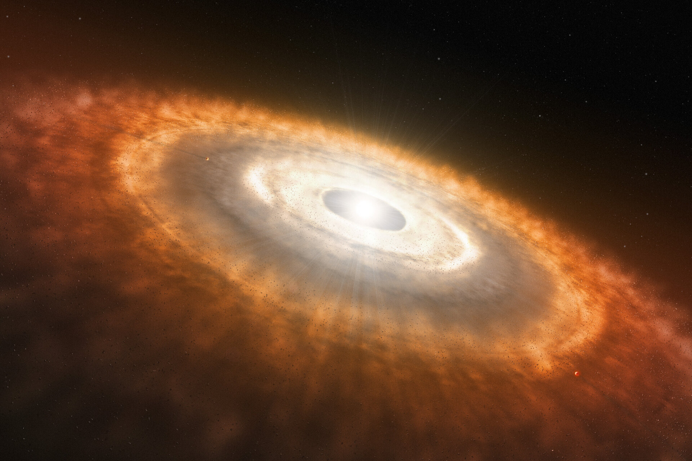
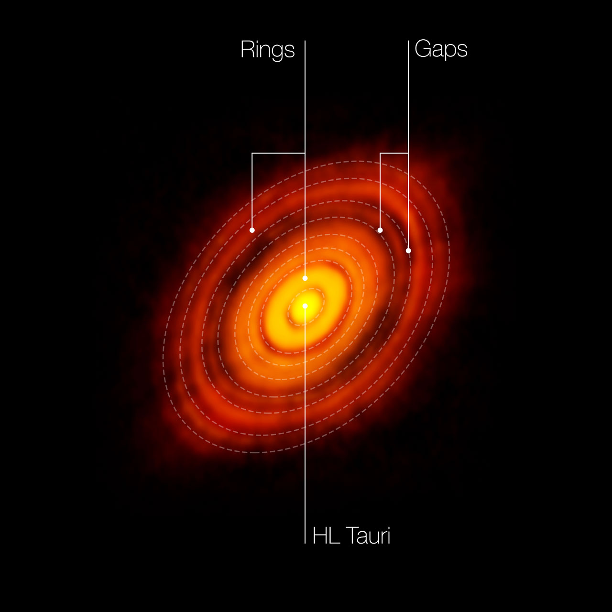
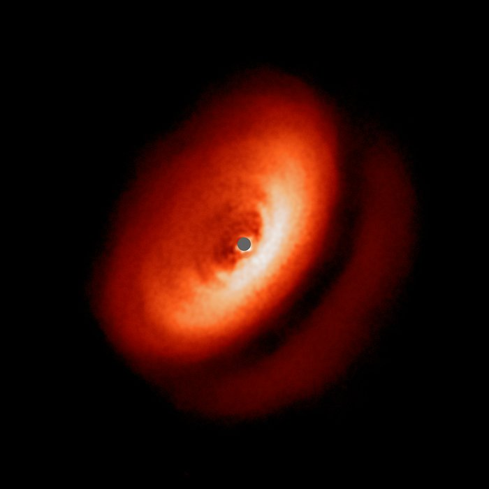
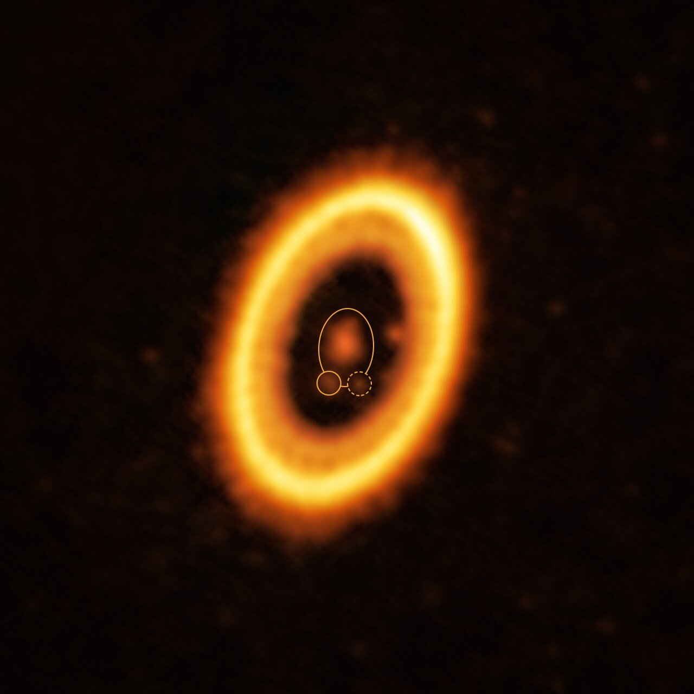
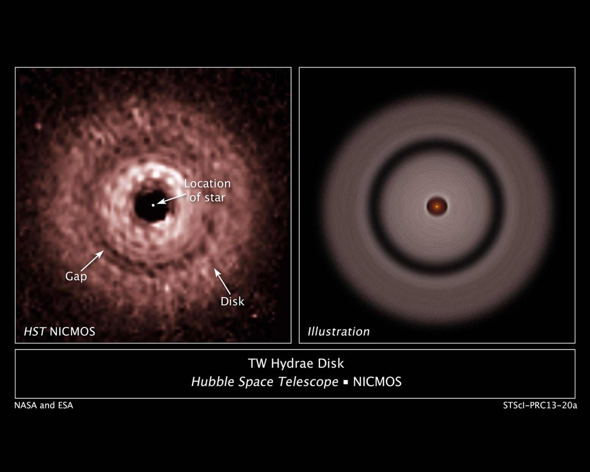
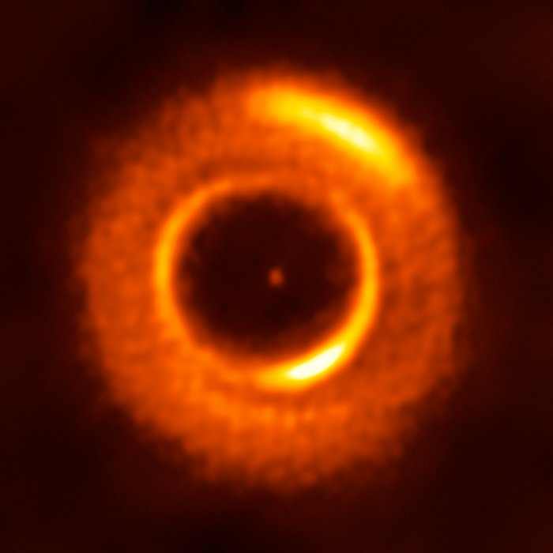
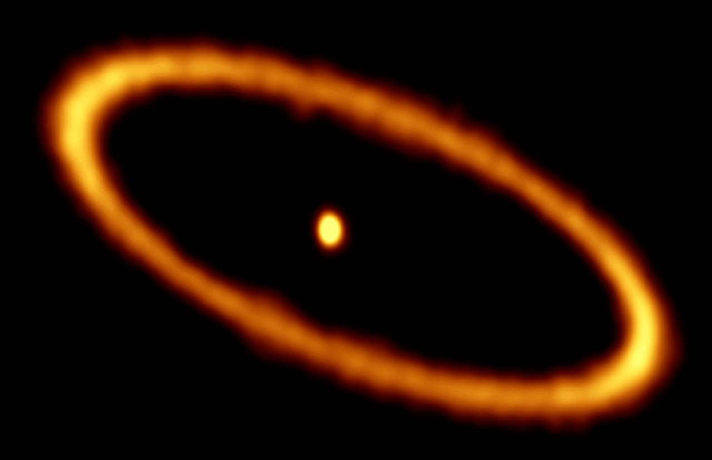
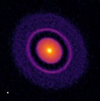
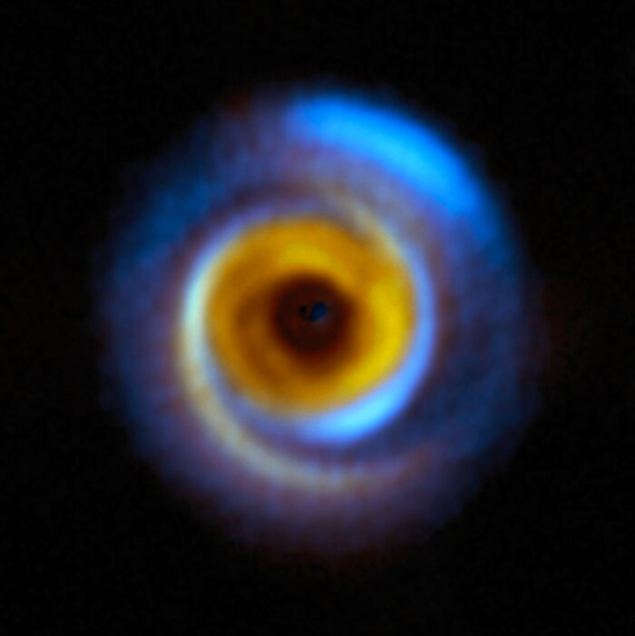
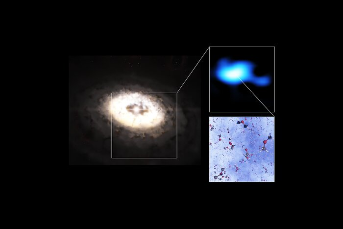

  
  
  
  
  

::: {.catalog-hero .index-hero}

::: {.catalog-hero-text}

::: {.hero-kicker}
Catálogo educativo · Ciencia de datos · Discos protoplanetarios
:::

# Catálogo piloto de discos protoplanetarios

Este **Catálogo piloto de discos protoplanetarios** es un recurso educativo y científico diseñado para explorar las propiedades físicas, morfologías y procesos evolutivos de discos donde pueden formarse planetas.

Esta versión piloto reúne explicaciones científicas breves, imágenes representativas, tablas comparativas, fichas individuales de discos, una actividad de ciencia de datos basada en imágenes FITS y una simulación sintética interactiva.

::: {.hero-badges}
5 discos piloto
Fichas científicas
Actividad con FITS
Simulación interactiva
DOI en Zenodo
:::

::: {.hero-actions}
[Explorar discos ↓](#discos-disponibles){.hero-button .hero-button-primary}
[Abrir actividad ↓](#actividades){.hero-button .hero-button-secondary}
[Cómo usar el catálogo ↓](#como-usar-catalogo){.hero-button .hero-button-secondary}
[Sobre el proyecto](sobre_el_proyecto.qmd){.hero-button .hero-button-secondary}
:::

:::

::: {.catalog-hero-image}
{.catalog-hero-photo}

::: {.hero-image-caption}
*Representación artística de una estrella joven rodeada por un disco protoplanetario donde se están formando planetas.*

Crédito: ESO/L. Calçada
:::

:::
:::

---

## Actividad de ciencia de datos {#actividades}

::: {.index-highlight}
Este catálogo incluye una **actividad de ciencia de datos basada en imágenes FITS** pensada para que estudiantes y personas interesadas trabajen con datos astronómicos reales. La actividad permite visualizar discos protoplanetarios, deproyectar imágenes, construir perfiles radiales de intensidad e identificar subestructuras como anillos, brechas o depresiones radiales.
:::

::: {.activity-grid}

::: {.activity-card}
### Análisis morfológico de subestructuras radiales

Usa una imagen FITS real de **IM Lup** o **HD 163296** para deproyectar el disco, transformarlo a coordenadas polares, construir un perfil radial de intensidad e identificar anillos, brechas o depresiones radiales.

[Abrir actividad →](activity_morphology_es.html){.disk-link}
:::

::: {.activity-card}
### ¿Qué se aprende?

Esta actividad conecta la observación astronómica con herramientas básicas de ciencia de datos. Permite explorar cómo una imagen de ALMA puede transformarse en un perfil radial y cómo ese perfil ayuda a reconocer estructuras asociadas con la evolución del disco y la formación planetaria.

[Ver recursos del proyecto →](sobre_el_proyecto.qmd){.disk-link}
:::

:::

---

## Discos disponibles {#discos-disponibles}

::: {.section-intro}
La muestra piloto incluye cinco discos protoplanetarios bien estudiados. Cada ficha resume propiedades generales del sistema, morfología del disco, subestructuras observadas, distribución de gas y polvo, evidencia de formación planetaria e interpretación física.
:::

::: {.disk-grid}

::: {.disk-card}
{width=100%}

*Imagen anotada de ALMA del disco protoplanetario que rodea a la joven estrella HL Tau. La estructura de anillos y brechas visible en la emisión de polvo muestra variaciones en la distribución del material sólido.*  
**Crédito:** ALMA (ESO/NAOJ/NRAO).

### HL Tau

Disco protoplanetario joven conocido por sus anillos y brechas concéntricas reveladas por observaciones de alta resolución de ALMA.

[Abrir ficha del disco →](hl_tau.qmd){.disk-link}
:::

::: {.disk-card}
{width=100%}

*Imagen de ALMA del disco protoplanetario alrededor de AS 209, donde se observan múltiples anillos y brechas estrechas que podrían estar relacionadas con formación planetaria.*  
**Crédito:** ALMA (ESO/NAOJ/NRAO); A. Sierra (U. Chile).

### AS 209

Disco observado con ALMA que muestra múltiples anillos y brechas estrechas, interpretadas frecuentemente como posibles señales de formación planetaria.

[Abrir ficha del disco →](as_209.qmd){.disk-link}
:::

::: {.disk-card}
{width=100%}

*Imagen compuesta de ALMA del disco protoplanetario alrededor de HD 163296. El componente rojo traza polvo, mientras que la emisión azul muestra gas de monóxido de carbono; las depresiones en el disco externo sugieren la presencia de planetas en formación.*  
**Crédito:** ALMA (ESO/NAOJ/NRAO); A. Isella; B. Saxton (NRAO/AUI/NSF).

### HD 163296

Disco con subestructuras claras donde las observaciones de polvo y gas sugieren la presencia de planetas en formación embebidos en el disco externo.

[Abrir ficha del disco →](hd_163296.qmd){.disk-link}
:::

::: {.disk-card}
{width=100%}

*Imagen de alta resolución obtenida con SPHERE del disco de polvo alrededor de la joven estrella IM Lup, donde se observan estructuras finas en luz dispersada.*  
**Crédito:** ESO/H. Avenhaus et al./DARTT-S collaboration.

### IM Lup

Disco protoplanetario grande y extendido, observado en luz dispersada, que muestra estructuras detalladas de polvo en sus regiones externas.

[Abrir ficha del disco →](im_lup.qmd){.disk-link}
:::

::: {.disk-card}
{width=100%}

*Imagen de ALMA del joven sistema planetario PDS 70, donde se observa un disco circumestelar en el que se están formando planetas. El sistema contiene los planetas confirmados PDS 70 b y PDS 70 c dentro de la cavidad del disco.*  
**Crédito:** ALMA (ESO/NAOJ/NRAO) / Balsalobre-Ruza et al.

### PDS 70

Sistema joven famoso por albergar planetas en formación detectados directamente dentro de la cavidad de su disco protoplanetario.

[Abrir ficha del disco →](pds_70.qmd){.disk-link}
:::

::: {.disk-card .add-disk-card}

＋

### Agregar un nuevo disco

Este catálogo está diseñado para crecer. Es posible incorporar nuevos discos protoplanetarios, información científica actualizada, referencias recientes, imágenes, actividades o mejoras en la simulación.

[Proponer una contribución →](investigaciones_publicaciones.qmd){.disk-link}

:::

:::

---

## ¿Qué es un disco protoplanetario?

Un disco protoplanetario es una estructura joven, aplanada y en rotación que se forma alrededor de una estrella durante sus primeras etapas de evolución. Cuando una nube molecular colapsa, parte del material no cae directamente sobre la protoestrella, sino que queda orbitando a su alrededor debido a la conservación del momento angular [@williams2011; @andrews2020].

Estos discos están compuestos principalmente por **gas y polvo**. El gas domina la masa total del disco, mientras que el polvo contiene los granos sólidos que pueden crecer, acumularse y participar en la formación de cuerpos más grandes. Por eso, los discos protoplanetarios se consideran reservorios de material y lugares de nacimiento de sistemas planetarios [@andrews2020].

En etapas tempranas, los discos suelen observarse alrededor de estrellas jóvenes, como las estrellas T Tauri. Cuando la envoltura inicial ya se ha dispersado, el sistema deja de ser principalmente protoestelar y pasa a una fase propiamente protoplanetaria. En esa etapa, el disco contiene solo una fracción pequeña de la masa estelar, suele tener una geometría acampanada y su gas se mueve aproximadamente de forma kepleriana [@williams2011].

Estos discos no solo almacenan material: también son el escenario donde comienza la formación planetaria. En el modelo de acreción de núcleo, los granos de polvo crecen mediante colisiones, forman agregados, planetesimales y núcleos protoplanetarios capaces de capturar gas [@williams2011]. Por eso, estudiar la masa, estructura y evolución de un disco ayuda a entender qué tipos de planetas podrían formarse y cómo sus propiedades dependen de las condiciones físicas del disco [@andrews2020].

### ¿Cómo observamos los discos protoplanetarios?

Los discos protoplanetarios se estudian en diferentes longitudes de onda porque cada trazador revela una parte distinta del sistema [@andrews2020]. En el óptico y el infrarrojo cercano, la **luz dispersada** permite observar granos pequeños en la superficie del disco. En el infrarrojo medio, se detecta mejor el polvo cálido de las regiones internas. En longitudes de onda submilimétricas y milimétricas, la **emisión continua térmica** permite estudiar sólidos fríos, mientras que la **emisión de líneas moleculares** entrega información sobre el gas y su dinámica [@andrews2020].

Debido a que muchos discos son fríos, pequeños en el cielo y brillan eficientemente en longitudes de onda milimétricas, la radiointerferometría se ha vuelto esencial. Gran parte del avance reciente en el estudio de discos protoplanetarios y sus subestructuras ha sido impulsado por **ALMA** [@andrews2020].

::: {.tracer-gallery}

::: {.tracer-card}
### Luz dispersada

{.trace-image}

*Imagen en luz dispersada del disco protoplanetario alrededor de TW Hydrae, observada con el Telescopio Espacial Hubble/NICMOS. Una máscara coronográfica bloquea la estrella central y permite detectar la luz tenue proveniente de la superficie del disco.*

**Crédito:** NASA, ESA, J. Debes (STScI), H. Jang-Condell (University of Wyoming), A. Weinberger (Carnegie Institution of Washington), A. Roberge (Goddard Space Flight Center), G. Schneider (University of Arizona/Steward Observatory), and A. Feild (STScI/AURA).
:::

::: {.tracer-card}
### Continuo térmico

{.trace-image}

*Imagen de continuo térmico del disco protoplanetario alrededor de MWC 758, observada con ALMA en banda 7 a 870 μm. A estas longitudes de onda, la emisión traza polvo del disco y revela su estructura anillada.*

**Crédito:** ESO/R. Dong et al.; ALMA (ESO/NAOJ/NRAO).
:::

::: {.tracer-card}
### Emisión de líneas moleculares

{.trace-image}

*Imagen compuesta de ALMA del disco protoplanetario alrededor de HD 163296. El componente rojo interno muestra emisión continua de polvo, mientras que el disco azul más extendido traza gas de monóxido de carbono observado mediante emisión de líneas moleculares.*

**Crédito:** ALMA (ESO/NAOJ/NRAO); A. Isella; B. Saxton (NRAO/AUI/NSF).
:::

:::

---

## Subestructuras principales en discos

::: {.substructure-grid-clean}

::: {.substructure-row}
::: {.substructure-name}
Anillo
:::
::: {.substructure-text}
Banda brillante del disco donde la emisión aumenta respecto de las regiones vecinas. En las imágenes suele verse como una estructura anular relativamente estrecha que destaca sobre el material circundante.
:::
:::

::: {.substructure-row}
::: {.substructure-name}
Brecha
:::
::: {.substructure-text}
Banda más tenue ubicada entre anillos brillantes. En observaciones de continuo milimétrico suele interpretarse como una reducción local del polvo milimétrico respecto de los anillos adyacentes, no necesariamente como una región completamente vacía.
:::
:::

::: {.substructure-row}
::: {.substructure-name}
Cavidad
:::
::: {.substructure-text}
Región interna amplia con emisión mucho más débil, normalmente rodeada por un anillo externo brillante. A diferencia de una brecha, que suele ser una depresión estrecha entre anillos, una cavidad corresponde a un despeje central más extenso.
:::
:::

::: {.substructure-row}
::: {.substructure-name}
Arco
:::
::: {.substructure-text}
Estructura brillante que cubre solo una parte del disco y no forma un círculo completo. Puede verse como un anillo parcial o como una concentración localizada de emisión en un sector del disco.
:::
:::

::: {.substructure-row}
::: {.substructure-name}
Espiral
:::
::: {.substructure-text}
Estructura curva similar a un brazo que se extiende a través del disco. Las espirales pueden estar asociadas con inestabilidades gravitacionales, perturbaciones dinámicas o interacciones planeta-disco.
:::
:::

:::

---

## El polvo y el gas no trazan el mismo disco

Un disco protoplanetario no se ve igual en todos los trazadores, porque cada observación resalta un componente físico distinto. Las observaciones de polvo permiten estudiar la distribución de sólidos, mientras que las líneas moleculares permiten investigar propiedades del gas como temperatura, densidad, estructura vertical, turbulencia y cinemática [@andrews2020].

En el componente de polvo, la diferencia depende tanto del instrumento como de la evolución de las partículas. Los granos pequeños suelen permanecer mejor mezclados con el gas y se observan en la superficie del disco mediante luz dispersada. En cambio, los granos más grandes tienden a asentarse hacia el plano medio, derivar radialmente y acumularse en máximos de presión [@birnstiel2024_dustgrowth]. Por eso, el mismo disco puede tener apariencias distintas en luz dispersada, continuo térmico y líneas moleculares.

Un ejemplo útil es **HD 100546**. Pérez et al. (2020) compararon observaciones de ALMA en continuo de 1.3 mm con emisión molecular de isotopólogos de CO. En el continuo, el disco muestra un anillo ancho de polvo con estructura radial y azimutal compleja. Sin embargo, el gas no reproduce simplemente el mismo patrón: los mapas de ^12^CO muestran perturbaciones cinemáticas respecto de la rotación kepleriana, especialmente cerca del anillo de continuo. Esto convierte a HD 100546 en un buen ejemplo de por qué las imágenes de polvo y la cinemática del gas deben interpretarse en conjunto: el polvo muestra dónde se concentra el material sólido, mientras que el gas revela movimientos, estructura vertical y posibles perturbaciones dinámicas asociadas con interacciones planeta-disco [@perez2020_hd100546].

---

## Del polvo a los planetas

::: {.dust-planets-section}

::: {.dust-intro-box}
El camino desde el polvo hasta los planetas comienza con partículas extremadamente pequeñas. En los discos protoplanetarios, el material sólido inicia en tamaños microscópicos y luego puede crecer mediante colisiones, asentarse hacia el plano medio, derivar radialmente y, en algunos casos, quedar atrapado en estructuras de presión. Estos procesos hacen posible la formación planetaria, pero también la vuelven difícil: los sólidos deben crecer evitando tanto la fragmentación como la rápida caída hacia la estrella.
:::

::: {.dust-pathway-grid}

::: {.dust-pathway-card}
### 1. Crecimiento y asentamiento

Los granos chocan entre sí y, cuando las colisiones son suficientemente suaves, pueden pegarse y formar agregados progresivamente más grandes. A medida que crecen, se acoplan menos al gas y tienden a asentarse hacia el plano medio del disco, aunque la turbulencia puede volver a mezclar parte del material [@williams2011].
:::

::: {.dust-pathway-card}
### 2. Deriva radial y barreras de crecimiento

Cuando el polvo crece, su interacción aerodinámica con el gas se vuelve más importante. El gas suele orbitar de forma ligeramente subkepleriana, generando un viento en contra para las partículas sólidas. Ese efecto les hace perder momento angular y migrar hacia el interior del disco. Además, las colisiones pueden volverse destructivas, produciendo rebote, erosión o fragmentación [@birnstiel2024_dustgrowth].
:::

::: {.dust-pathway-card}
### 3. Trampas de polvo y planetesimales

Las regiones donde la deriva radial se frena son especialmente relevantes. En máximos locales de presión, el polvo puede quedar atrapado y acumularse. Estas concentraciones pueden crear condiciones favorables para la formación de planetesimales, que luego pueden convertirse en los bloques iniciales de núcleos planetarios [@birnstiel2024_dustgrowth].
:::

:::

::: {.dust-bridge-box}
En este sentido, las **trampas de polvo** conectan la evolución física de los sólidos con la aparición de anillos, brechas y otras subestructuras. También forman un puente entre la morfología observable del disco y la formación de planetesimales.
:::

::: {.planet-example-grid}

::: {.planet-example-card}
::: {.example-label}
Formación de planetas de baja masa
:::

### HD 169142: un posible mini-Neptuno

Un ejemplo concreto de la conexión entre polvo y formación planetaria es el disco de **HD 169142**. Pérez et al. (2019) usaron observaciones de ALMA a 1.3 mm para resolver el disco externo en tres anillos estrechos. Su interpretación sugiere que esta arquitectura de polvo puede estar relacionada con la presencia de un planeta de baja masa.

En este caso, los autores proponen que los anillos externos pueden explicarse mediante un planeta migrante de aproximadamente 10 masas terrestres. Ese objeto, comparable a un mini-Neptuno, podría modificar la distribución del polvo y producir anillos y brechas alrededor de su órbita. Así, HD 169142 muestra cómo el polvo no solo es materia prima para formar planetas, sino también un trazador indirecto de protoplanetas que aún no han sido detectados directamente [@perez2019_mini_neptune].
:::

::: {.planet-example-card}
::: {.example-label}
Planetas gigantes y material circumplanetario
:::

### V4046 Sgr: trampas de polvo y una posible sombra de disco circumplanetario

Un ejemplo complementario es el disco circumbinario de **V4046 Sgr**, donde las estructuras de polvo podrían reflejar una arquitectura planetaria más avanzada. Weber et al. (2022) combinaron simulaciones hidrodinámicas y transferencia radiativa para comparar modelos con observaciones en luz dispersada e imágenes milimétricas.

El modelo sugiere que los anillos y brechas observados son consistentes con dos planetas gigantes ubicados aproximadamente a 9 au y 20 au, con un máximo de presión entre ellos donde el polvo puede acumularse. El estudio también propone que una disminución localizada del brillo en luz dispersada podría explicarse como una sombra producida por un disco circumplanetario. De este modo, V4046 Sgr ilustra que las subestructuras de polvo pueden señalar no solo planetas embebidos, sino también material circumplanetario asociado a ellos [@weber2022_v4046sgr].
:::

:::

:::

---

## Después de la fase protoplanetaria

::: {.after-phase-section}

::: {.after-phase-hero}
::: {.after-phase-kicker}
Contexto evolutivo
:::

Este catálogo se centra en discos protoplanetarios, pero la evolución de un sistema planetario no termina cuando el disco primordial comienza a dispersarse. En etapas posteriores pueden existir **discos de escombros**, donde el polvo ya no corresponde principalmente al material original del disco joven, sino que se repone continuamente mediante colisiones entre cuerpos mayores, como planetesimales, asteroides o cometas.
:::

::: {.debris-showcase}

::: {.debris-figure-card}
{.debris-image}

::: {.debris-caption}
*Imagen de ALMA del anillo de escombros alrededor de Fomalhaut, una estrella cercana y brillante ubicada a unos 25 años luz. El anillo está compuesto por polvo liberado en colisiones entre exocometas y cuerpos pequeños, representando una etapa evolutiva posterior a los discos protoplanetarios ricos en gas presentados en este catálogo.*

**Crédito:** ALMA (ESO/NAOJ/NRAO) / L. Matrà / M. A. MacGregor
:::
:::

::: {.debris-definition-card}
### ¿Qué es un disco de escombros?

::: {.debris-point}
**Contenido de gas:** tradicionalmente se consideraba que los discos de escombros eran sistemas pobres en gas, porque se esperaba que el gas primordial del disco protoplanetario ya se hubiera disipado.
:::

::: {.debris-point}
**Origen del polvo:** a diferencia de los discos protoplanetarios, el polvo en discos de escombros suele ser material de segunda generación, producido por colisiones.
:::

::: {.debris-point}
**Rol evolutivo:** los discos de escombros ayudan a entender qué puede permanecer después de la fase principal de formación planetaria.
:::
:::

:::

::: {.hybrid-study-card}
### HD 121617: un posible disco híbrido

Observaciones recientes muestran que algunos discos de escombros todavía contienen gas. Un ejemplo útil es **HD 121617**, estudiado por Weber et al. (2026) como parte del sondeo ARKS. En este sistema, ALMA observa un anillo estrecho con un arco brillante en emisión milimétrica, mientras que VLT/SPHERE muestra un anillo de luz dispersada más simétrico y desplazado ligeramente hacia afuera.

::: {.hybrid-mini-grid}

::: {.hybrid-mini-card}
#### ¿Qué sugieren las observaciones?

El estudio propone que la estructura observada puede explicarse mediante interacciones entre polvo y gas. En este escenario, un anillo de gas inestable puede crear una trampa radial y azimutal para el polvo: los granos milimétricos se concentran en el arco visto por ALMA, mientras que los granos más pequeños, más afectados por la presión de radiación estelar, aparecen más lejos en luz dispersada.
:::

::: {.hybrid-mini-card}
#### ¿Por qué es importante?

Si la asimetría observada por ALMA es causada por arrastre de gas, entonces HD 121617 requeriría más gas total que el inferido solo a partir de CO. Esto podría indicar la presencia de gas primordial remanente de la fase protoplanetaria. Por esa razón, los autores sugieren que HD 121617 podría ser un **disco híbrido**, un sistema que conecta la etapa protoplanetaria con la etapa de disco de escombros [@weber2026_arks_ix].
:::

:::

::: {.after-phase-takeaway}
**Idea clave:** los discos de escombros no son simplemente el final de la evolución de los discos. Algunos pueden conservar gas y mostrar interacciones polvo-gas, por lo que son sistemas valiosos para conectar discos protoplanetarios con etapas posteriores de sistemas planetarios.
:::

:::

:::

---

## ¿Cómo evolucionan los discos protoplanetarios y desarrollan subestructuras?

::: {.disk-evolution-section}

::: {.evolution-intro-box}
La evolución de un disco protoplanetario puede entenderse como un proceso de redistribución de material y momento angular. Debido a que los discos se forman por conservación del momento angular, el gas no puede caer directamente sobre la estrella: para acrecer, debe transferir parte de su movimiento orbital hacia otras regiones del disco [@williams2011]. Por eso, mientras una parte del material se mueve gradualmente hacia el interior, otra puede expandirse hacia radios mayores [@armitage2011].
:::

::: {.evolution-mechanism-grid}

::: {.evolution-mechanism-card}
### Transporte de momento angular

La evolución de los discos suele describirse mediante una viscosidad efectiva, entendida no como fricción molecular ordinaria, sino como una forma simplificada de representar el transporte de momento angular. En muchos modelos, esa eficiencia se resume mediante el parámetro **α** [@armitage2011].
:::

::: {.evolution-mechanism-card}
### Turbulencia y autogravedad

Entre los mecanismos relevantes se encuentran la inestabilidad magnetorrotacional, capaz de iniciar y sostener turbulencia magnetohidrodinámica, y la autogravedad, que en discos suficientemente fríos y masivos puede generar brazos espirales y redistribuir tanto masa como momento angular [@armitage2011].
:::

::: {.evolution-mechanism-card}
### Máximos de presión y subestructuras

Muchas subestructuras observadas probablemente trazan máximos locales de presión del gas, donde la migración de sólidos se frena y el material puede acumularse. Estos máximos pueden surgir por inestabilidades del fluido o por interacciones planeta-disco, produciendo anillos, brechas, espirales, asimetrías, arcos o estructuras tipo creciente [@andrews2020].
:::

:::

::: {.evolution-example-grid}

::: {.evolution-example-card}
::: {.example-label}
Inestabilidad gravitacional
:::

### Elias 2-27: brazos espirales en un disco masivo

Un ejemplo de esta diversidad es **Elias 2-27**, un disco con dos brazos espirales prominentes observados en el continuo milimétrico de polvo. Paneque-Carreño et al. (2021) analizaron observaciones de ALMA en varias longitudes de onda y encontraron que la morfología espiral aparece en la emisión de polvo, mientras que el gas también muestra perturbaciones cinemáticas fuertes asociadas con las regiones espirales.

En este sistema, las espirales se interpretan como posible evidencia de inestabilidad gravitacional, un proceso que puede ocurrir cuando el disco es suficientemente frío y masivo para que su propia gravedad influya en la estructura. El estudio también reporta señales de atrapamiento de polvo, sugiriendo que los brazos espirales podrían actuar como estructuras de presión donde las partículas sólidas se acumulan y crecen [@panequecarreno2021_elias227].
:::

::: {.evolution-example-card}
::: {.example-label}
Evolución térmica
:::

### V883 Ori: cuando la acreción desplaza la línea de nieve

La evolución de los discos también puede estar fuertemente influida por cambios en su estructura térmica. Un ejemplo útil es **V883 Ori**, un objeto tipo FU Orionis que experimenta un estallido de acreción. En este sistema, Alarcón et al. (2024) muestran que la irradiación estelar pasiva por sí sola no reproduce la emisión milimétrica observada.

En su modelo, el calentamiento viscoso asociado con la acreción se vuelve una fuente dominante de energía dentro de la línea de nieve del agua. Esto aumenta la temperatura del disco, modifica su estructura y desplaza los frentes de condensación hacia radios mayores. V883 Ori recuerda que las líneas de nieve no son fronteras fijas: pueden moverse cuando cambia el presupuesto energético del disco, afectando la química, las propiedades del polvo y las condiciones locales para la formación planetaria [@alarcon2024_v883ori].
:::

:::

::: {.evolution-takeaway}
**Idea clave:** la morfología de un disco no es solo apariencia. Anillos, brechas, espirales, arcos, crecientes y líneas de nieve móviles son huellas observables de procesos físicos que redistribuyen material, cambian la temperatura del disco y condicionan la formación planetaria.
:::

:::

---

## Cómo usar y ampliar este catálogo {#como-usar-catalogo}

::: {.catalog-use-box}
Este catálogo fue diseñado como un recurso **educativo, científico, reproducible y ampliable** para explorar discos protoplanetarios de manera estructurada, comparativa y accesible. Su propósito no es solo reunir información sobre distintos sistemas, sino también ayudar a comprender cómo se estudian los discos, qué significan sus subestructuras y por qué son importantes para la formación planetaria.

Cada ficha de disco está organizada para guiar la lectura desde la identificación básica del sistema hasta su interpretación física. En general, las páginas incluyen secciones como **nombres del objeto**, **ubicación**, **descripción general**, **morfología**, **polvo**, **gas**, **evidencia de formación planetaria** e **interpretación física**.

El catálogo también está pensado como un proyecto abierto. Nuevos discos, información científica actualizada, imágenes, referencias, actividades de ciencia de datos y mejoras en la simulación pueden incorporarse editando los archivos fuente del repositorio de GitHub. El contenido principal está escrito en archivos `.qmd`, la información estructurada se almacena en `data/disks/*.json`, las referencias se gestionan en `references.bib` y el sitio puede renderizarse localmente con Quarto.

[Ver repositorio en GitHub](https://github.com/martinaAbarca/pilot-protoplanetary-disks-catalog){.disk-link}
:::

---

## Galería de subestructuras en discos

::: {.substructure-gallery}

::: {#fig-elias24}
{width=70% fig-alt="Anillos y brechas del disco protoplanetario Elias 24 observados con ALMA"}

Imagen de ALMA del disco protoplanetario **Elias 24**, donde se observan anillos y brechas concéntricas prominentes en la distribución de polvo. Estas subestructuras son comunes en discos donde podrían estar ocurriendo procesos relacionados con formación planetaria.  
**Crédito:** ALMA (ESO/NAOJ/NRAO), S. Andrews et al.; N. Lira.
:::

::: {#fig-mwc758}
{width=70% fig-alt="Estructuras espirales y arcos del disco protoplanetario MWC 758"}

Imagen compuesta del disco formador de planetas **MWC 758**, que combina observaciones infrarrojas del instrumento SPHERE en el Very Large Telescope de ESO con observaciones milimétricas de ALMA. La imagen revela estructuras asimétricas y arcos en la distribución de polvo que podrían estar relacionados con interacciones planeta-disco.  
**Crédito:** ESO/A. Garufi et al.; R. Dong et al.; ALMA (ESO/NAOJ/NRAO).
:::

::: {#fig-irs48}
{width=70% fig-alt="Trampa de polvo en forma de creciente del disco protoplanetario IRS 48 observada con ALMA"}

Imagen compuesta del disco formador de planetas **IRS 48 (Oph-IRS 48)**, donde se observa una trampa de polvo con forma de creciente en la que se acumulan granos de tamaño milimétrico. Estas estructuras pueden facilitar el crecimiento del polvo hacia cuerpos mayores durante la formación planetaria.  
**Crédito:** ESO/L. Calçada; ALMA (ESO/NAOJ/NRAO); A. Pohl; van der Marel et al.; Brunken et al.
:::

:::

Estas imágenes muestran que las subestructuras de los discos pueden variar mucho entre sistemas y entregar pistas sobre los procesos físicos que ocurren dentro de ellos.

---

## Referencias

::: {#refs}
:::